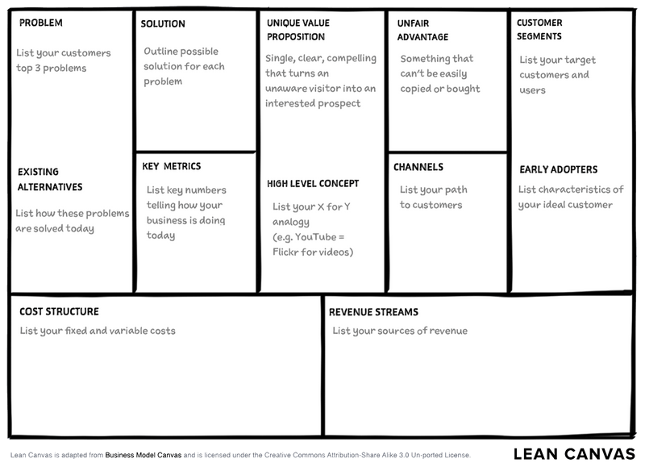

## Attendees
- Justin Port

## Objectives
1. Review progress since the last meeting.
2. Discuss and refine items in the backlog.
3. Assign responsibilities for the upcoming sprint.

## Notes
- This is note 1
- This is note 2
- This is note 3

